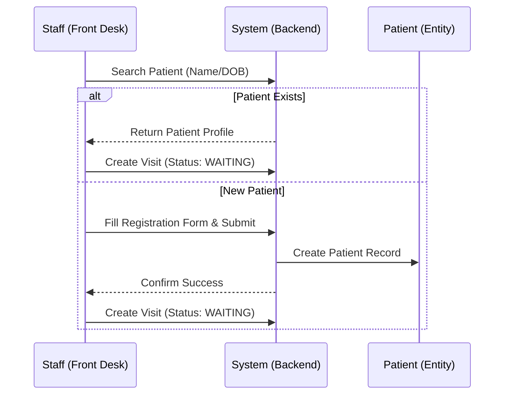
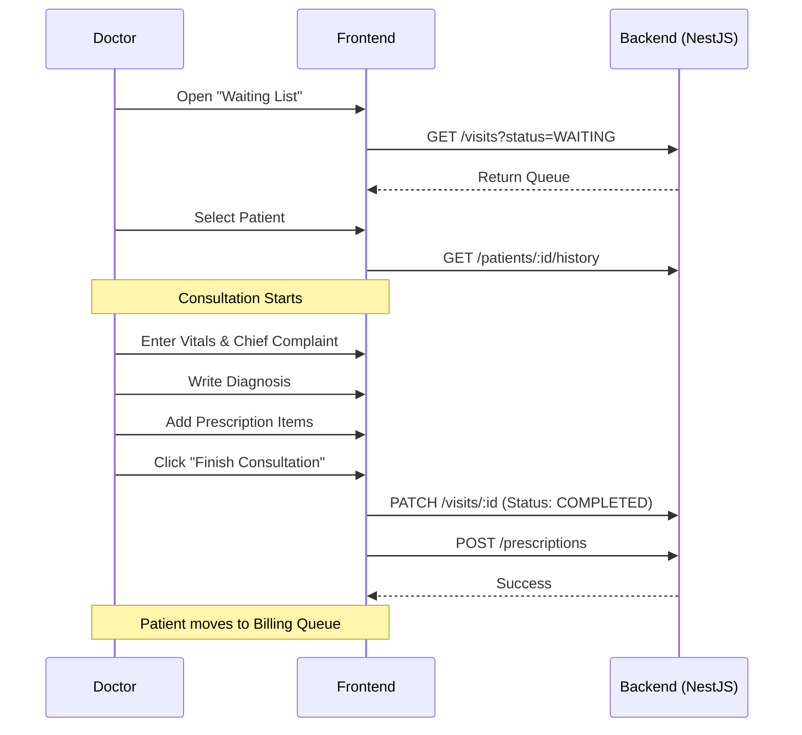
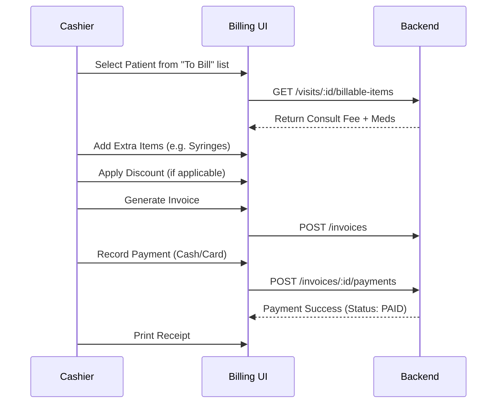

# User Flows (Critical Paths)

## 1. Patient Registration to Check-In

```mermaid
sequenceDiagram
    participant S as Staff (Front Desk)
    participant SYS as System (Backend)
    participant P as Patient (Entity)

    S->>SYS: Search Patient (Name/DOB)
    alt Patient Exists
        SYS-->>S: Return Patient Profile
        S->>SYS: Create Visit (Status: WAITING)
    else New Patient
        S->>SYS: Fill Registration Form & Submit
        SYS->>P: Create Patient Record
        SYS-->>S: Confirm Success
        S->>SYS: Create Visit (Status: WAITING)
    end
```

## 2. Doctor Consultation Workflow

```mermaid
sequenceDiagram
    participant D as Doctor
    participant UI as Frontend
    participant API as Backend (NestJS)

    D->>UI: Open "Waiting List"
    UI->>API: GET /visits?status=WAITING
    API-->>UI: Return Queue
    D->>UI: Select Patient
    UI->>API: GET /patients/:id/history

    Note over D, UI: Consultation Starts
    D->>UI: Enter Vitals & Chief Complaint
    D->>UI: Write Diagnosis
    D->>UI: Add Prescription Items

    D->>UI: Click "Finish Consultation"
    UI->>API: PATCH /visits/:id (Status: COMPLETED)
    UI->>API: POST /prescriptions
    API-->>UI: Success

    Note over D, UI: Patient moves to Billing Queue
```

## 3. Billing & Payment Flow

```mermaid
sequenceDiagram
    participant C as Cashier
    participant UI as Billing UI
    participant API as Backend

    C->>UI: Select Patient from "To Bill" list
    UI->>API: GET /visits/:id/billable-items
    API-->>UI: Return Consult Fee + Meds

    C->>UI: Add Extra Items (e.g. Syringes)
    C->>UI: Apply Discount (if applicable)
    C->>UI: Generate Invoice
    UI->>API: POST /invoices

    C->>UI: Record Payment (Cash/Card)
    UI->>API: POST /invoices/:id/payments
    API-->>UI: Payment Success (Status: PAID)

    C->>UI: Print Receipt
```
